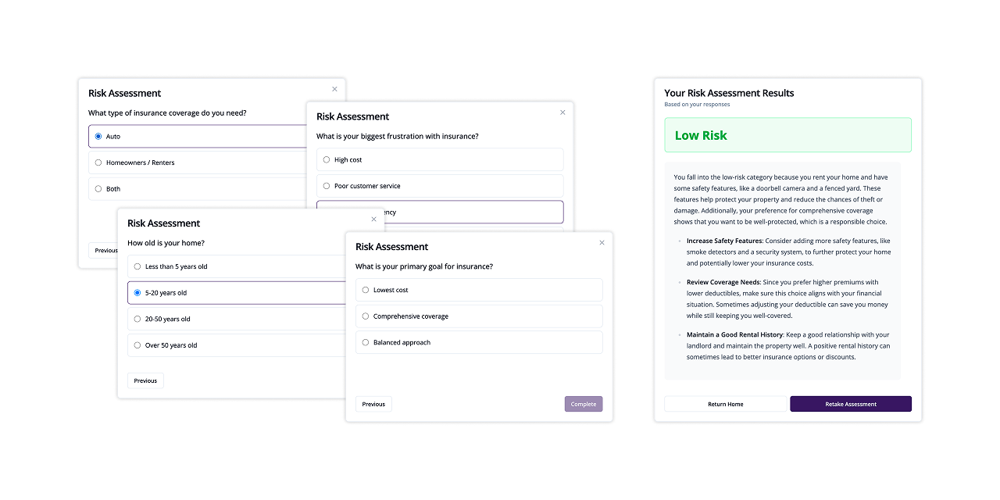

# Insurance Risk Assessment

Home and auto insurance risk assessment with AI-generated recommendations.

- Questionnaire that adapts to user answers
- AI-written explanation of the assessment result
- Accounts with saved assessment results
